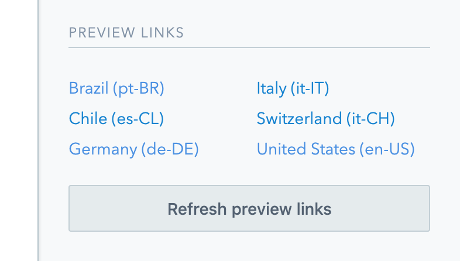
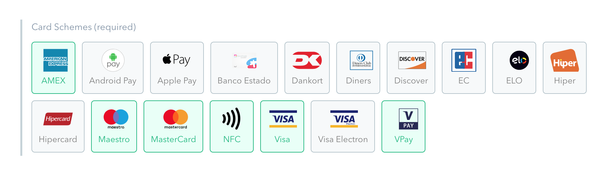

<div align="center">

# SumUp Contentful Extensions <!-- omit in toc -->

A collection of open-source [Contentful UI Extensions](https://www.contentful.com/developers/docs/concepts/uiextensions/) developed and used by [SumUp](https://sumup.com/). Includes tooling to quickly bootstrap a new extension.

[](https://lernajs.io/)

</div>

_At [SumUp](https://sumup.com/) we use [Contentful](https://contentful.com) as the CMS of choice for many of our web projects. Over time our use cases have become more complex and we've needed ways to enhance the editing experience for our content creators. Contentful allows us to customize and extend the functionality of the entry editor through [UI extensions](https://github.com/contentful/ui-extensions-sdk). Extensions can be custom user interface controls for fields (such as a dropdown) or help with workflows, data management and integrations._

## Table of Contents <!-- omit in toc -->

- [Extensions](#extensions)
  - [Image Data URI](#image-data-uri)
  - [Localized Preview Links](#localized-preview-links)
  - [Card Schemes](#card-schemes)
- [Development](#development)
  - [Getting started](#getting-started)
  - [Creating a new extension](#creating-a-new-extension)
  - [Local dev](#local-dev)
  - [Publishing to Contentful](#publishing-to-contentful)
- [Contributing](#contributing)
- [About SumUp](#about-sumup)

## Extensions

### [Image Data URI](https://github.com/sumup/contentful-extensions/tree/master/packages/image-data-uri)

This extension generates a data URI for an image asset. Useful for lazyloading images. Works with `Text` field types.


### [Localized Preview Links](https://github.com/sumup/contentful-extensions/tree/master/packages/localized-preview-links)

This sidebar extension generates localized preview links for a page. Works with `Boolean` field types (although the extension doesn't save any data).



### [Card Schemes](https://github.com/sumup/contentful-extensions/tree/master/packages/card-schemes)

This extension provides a visual editor to preview and select card schemes. Works with the `Symbols` field type.



## Development

This [quick introduction](https://www.contentful.com/developers/docs/concepts/uiextensions/) is a good place to get started with UI extensions. For more advanced and creative use cases, read this [blog post](https://www.contentful.com/blog/2017/10/09/creating-ui-extensions-with-contentful/). Refer to the [official SDK documentation](https://github.com/contentful/ui-extensions-sdk) for a list of available methods. You can also look through the existing extension files for inspiration.

### Getting started

We use [`lerna`](https://github.com/lerna/lerna) and [`yarn` workspaces](https://yarnpkg.com/lang/en/docs/workspaces/) under the hood to make developing and publishing our extensions a breeze. After you first clone the repo, you probably want to [bootstrap](https://github.com/lerna/lerna#bootstrap) all packages for development. Run the following command in the project root:

```bash
yarn bootstrap
```

This command will install the dependencies for all packages and link any cross-dependencies.

### Creating a new extension

You can quickly bootstrap a new UI extension by running this command in the project root:

```bash
yarn create:extension <EXTENSION_ID> "<EXTENSION_NAME>" <EXTENSION_TEMPLATE>
```

This will create a new folder `./packages/<EXTENSION_ID>` with all the files your extension needs. The command will also install the basic dependencies for your extension, so you can jump straight into development.

The extension UI goes inside `./src/index.html`. The logic lives inside `./src/index.js`. Any custom styles can be added to `./src/index.scss`, although the default styles provided by Contentful should be sufficient.

Two different **extension templates** are available: [**basic**](https://github.com/sumup/contentful-extensions/tree/master/templates/basic) (default) includes the above mentioned files. [**preact**](https://github.com/sumup/contentful-extensions/tree/master/templates/preact) extends the base template with — you guessed it — [Preact](https://github.com/developit/preact) for easier state management and DOM updates.

### Local dev

We use [`gulp`](https://github.com/gulpjs/gulp) to build, bundle and serve all code. Styles are written in SASS and JavaScript in ES6+. To start a development server with automatic reloading, run the following command inside your extension folder:

```bash
yarn dev
```

The development server is created by [`BrowserSync`](https://github.com/Browsersync/browser-sync), which generates a self-signed certificate to enable a secure `https` connection. This is important to get the extensions to work with Contentful's CSP policy. The first time you load the extension, you will likely get a security error. Simply add an exception for this certificate.

### Publishing to Contentful

During development, the extension is served from `https://localhost:1234`. Once your extension is finished, you can publish it to Contentful by running the following command inside your extension folder:

```bash
yarn cf:create --space-id <SPACE_ID> --environment-id <ENVIRONMENT_ID>
```

After you've published your extensions to a Contentful space for the first time, you need to run the following command in your extension folder to push any changes:

```bash
yarn cf:update --space-id <SPACE_ID> --environment-id <ENVIRONMENT_ID> --version <VERSION>
```

Both commands will bundle your code and upload it to the Contentful space and environment you specified.

Visit the [Contentful CLI docs](https://github.com/contentful/contentful-cli/tree/master/docs/extension) for more up-to-date instructions to publish, update or manage the UI extensions on Contentful.

## Contributing

If you have ideas for how we could improve this readme or the project in general, [let us know](https://github.com/sumup/contentful-extensions/issues) or [contribute some](https://github.com/sumup/contentful-extensions/edit/master/template/README.md)!

## About SumUp

[SumUp](https://sumup.com) is a mobile-point of sale provider. It is our mission to make easy and fast card payments a reality across the _entire_ world. You can pay with SumUp in more than 30 countries, already. Our engineers work in Berlin, Cologne, Sofia, and Sāo Paulo. They write code in JavaScript, Swift, Ruby, Elixir, Erlang, and much more. Want to come work and with us? [Head to our careers page](https://sumup.com/careers) to find out more.
